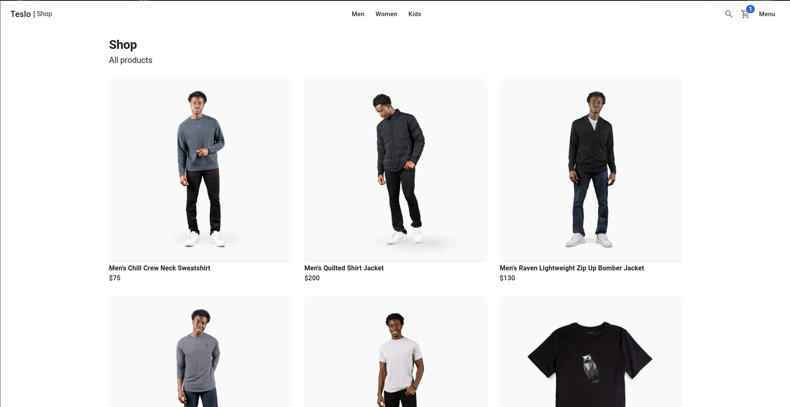
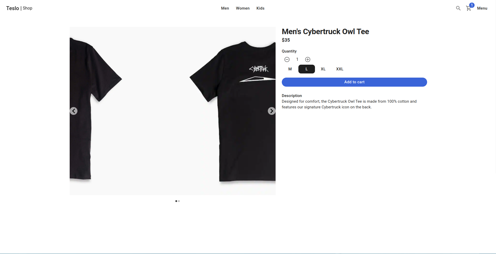
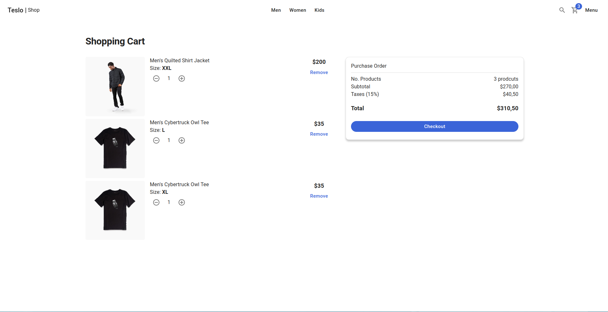
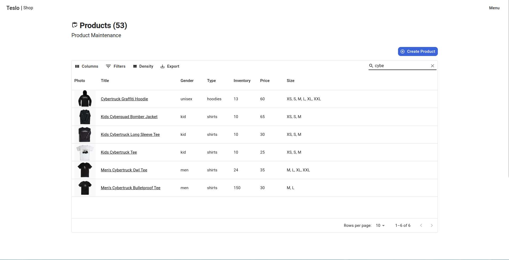
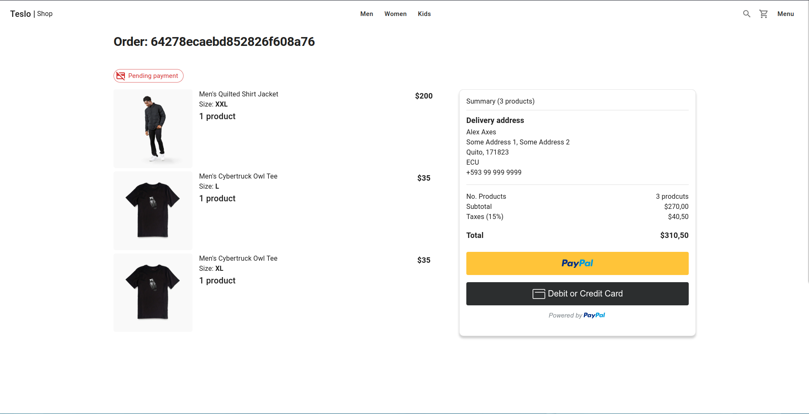
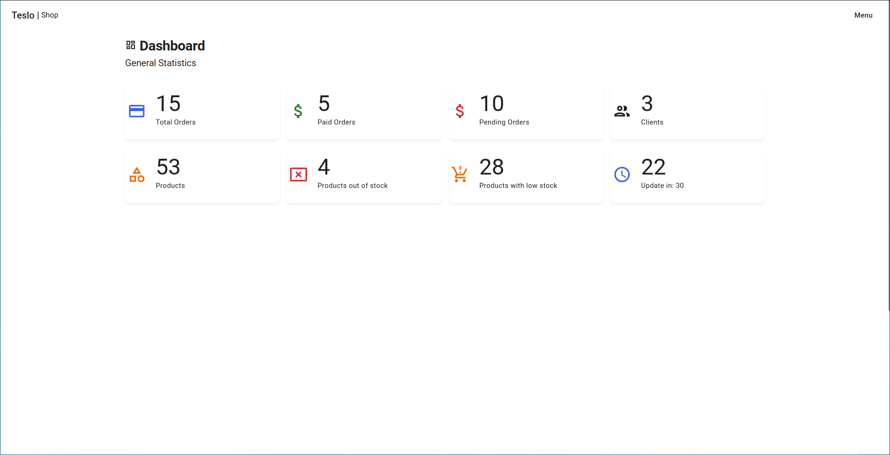
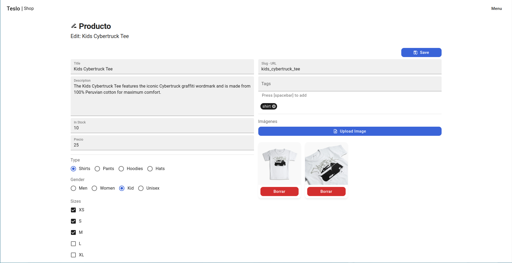

# TesloShop

This is a Next.js project bootstrapped with `pnpm create next-app --typescript`.

## Features

⚡️ Next.js v13\
⚡️ Context API\
⚡️ SWR\
⚡️ MUI\
⚡️ NextAuth\
⚡ Docker

## Getting Started

### .env

Create `.env` file based on `.env.template`

### Run the development server with Docker 🐳 :

```bash
# install pnpm
npm i -g pnpm

# install deps
pnpm i

# run docker contaniers
docker compose -f docker-compose.dev.yml up --build

# run dev server
pnpm run dev

# stop and remove containers & networks
docker compose -f docker-compose.dev.yml down

```

### Run the production server with Docker 🐳 :

```bash

# docker compose
docker compose up --build -d

```

## View demo

To see the real-time behavior you can log in with:

- Admin: `alex@axes.com` and password `123123`
- User: `david@martin.com` and password `123123`

<a href="https://next-teslo-shop-six.vercel.app" target="_blank">Demo</a>


### Screenshots




| | | 
|:-------------------------:|:-------------------------:|
|     |   
|     |   
|     |   